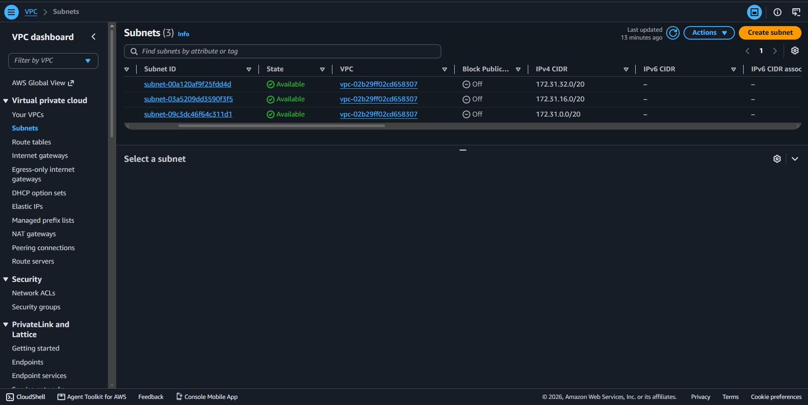
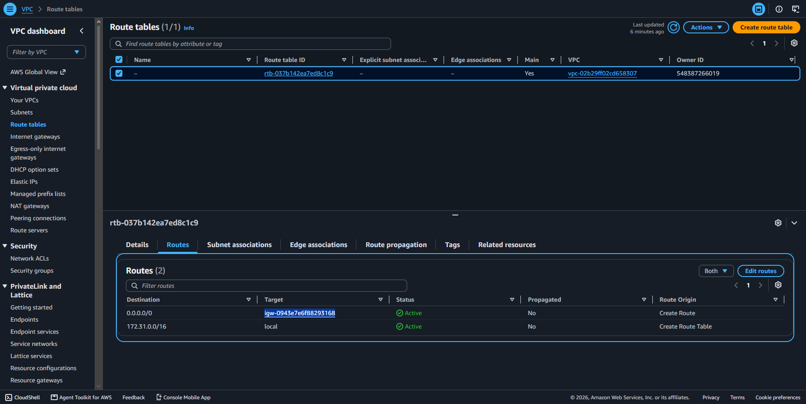
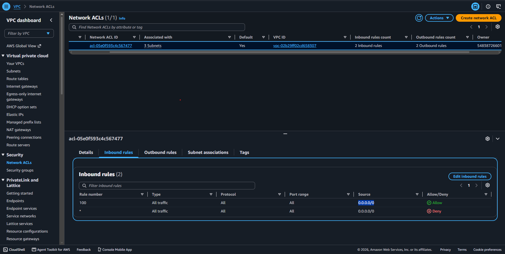
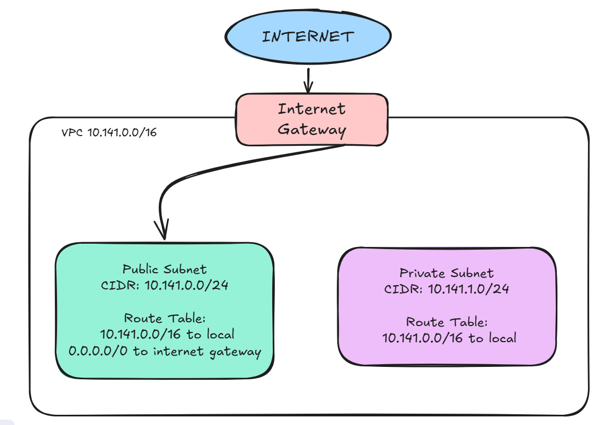

# Assignment 2 Submission

<!--
How to use this template:

1. Copy this file to submissions/assignment-2/<your-github-username>/submission.md
2. Replace every answer placeholder with your own answer. Delete the angle brackets too.
3. Save your four images in the same folder, with the exact file names below.
4. Do not write your full name or your student number in this file.
-->

## About me

- GitHub username: shaeluh
- Section: DCSAD
- IAM user name that I signed in with: dcsad-g08
- X: 141

---

## Part A. Explore

### A1. The VPC

Default VPC IPv4 CIDR:
172.31.0.0/16

Number of addresses in that CIDR:

65,536

### A2. The subnets

| Availability Zone | IPv4 CIDR |
| --- | --- |
| ap-southeast-1a | 172.31.32.0/20 |
| ap-southeast-1b | 172.31.16.0/20 |
| ap-southeast-1c | 172.31.0.0/20 |

Screenshot 1. Save it as `screenshot-1-subnets.png` in your folder. The image line below shows it.

### A3. Available addresses

Available IPv4 addresses in each subnet:

ap-southeast-1a: 4090
ap-southeast-1b: 4091
ap-southeast-1c: 4091

Why is the number lower than 4,096?

Every subnet loses 5 addresses because AWS reserves them: the network address, the VPC router, the Amazon DNS server, one for future use, and the broadcast address. My numbers match 4,096 - 5 = 4,091.

What uses the missing address in the subnet with the lowest number?

The ap-southeast-1a subnet shows 4,090, one less than the others, because an EC2 instance running there has a network interface that uses one private IP address from the subnet.

### A4. The route table

| Destination | Target |
| --- | --- |
| 0.0.0.0/0 | igw-0943e7e6f88293168 |
| 172.31.0.0/16 | local |

Screenshot 2. Save it as `screenshot-2-routes.png` in your folder. The image line below shows it.

### A5. Public or private

Are the default subnets public or private? Which route proves it?

The default subnets are public because their route table has a default route (`0.0.0.0/0`) that points to an Internet Gateway.

### A6. The internet gateway

State of the internet gateway:

Attached

What happens to the default subnets if the gateway is detached?

If the Internet Gateway is detached from the VPC, the default subnets will no longer have a path to the internet through the Internet Gateway. Their `0.0.0.0/0` route would no longer provide internet connectivity.

### A7. NAT gateways

Number of NAT gateways:

0

Can a server in a new private subnet download updates? Why?

If I add a private subnet to this VPC, a server in it cannot download updates from the internet because there is no NAT gateway to provide outbound internet access for the private subnet.

### A8. The network ACL

| Rule number | Source | Allow or Deny |
| --- | --- | --- |
| 100 | 0.0.0.0/0 | Allow |
| * | 0.0.0.0/0 | Deny |

How is a network ACL different from a security group?

 network ACL controls traffic at the subnet level, while a security group controls traffic at the instance level. Network ACLs can have both Allow and Deny rules, while security groups use Allow rules.

Screenshot 3. Save it as `screenshot-3-network-acl.png` in your folder. The image line below shows it.

### A9. The default security group

Inbound rule (type and source):

Type: All traffic
Source: sg-0c5b6d4081cf0a534

Which resources can send traffic to an instance that uses it?

Resources that use the same security group can send traffic to an instance that uses this security group, because the inbound rule allows all traffic from the security group itself.

---

## Part B. Prepare

### B1. Plan two subnets

- Public subnet CIDR: 10.141.0.0/24
- Private subnet CIDR: 10.141.1.0/24

### B2. Route tables

Route table of the public subnet:

| Destination | Target |
| --- | --- |
| 10.141.0.0/16 | local |
| 0.0.0.0/0 | internet gateway |

Route table of the private subnet:

| Destination | Target |
| --- | --- |
| 10.141.0.0/16 | local |

### B3. My VPC diagram

Tool used (Excalidraw, draw.io, Lucidchart, or paper):

Excalidraw

Save your diagram as `vpc-diagram.png` in your folder. The image line below shows it.

### B4. Predict a change

Can you still open the web page from your laptop? Why?

No. I cannot open the instance web page from my laptop because deleting the `0.0.0.0/0` route removes the route from the subnet to the Internet Gateway, so the instance can no longer receive internet traffic.

Can the instance still reach another instance in the VPC? Why?

Yes. The instance can still reach another instance in the same VPC because the local route for the VPC remains in the route table. The local route allows communication between resources within the VPC.

### B5. Place a database

Which subnet gets the database? Why?

I would place the database server in the private subnet (`10.141.1.0/24`) because the database should not be directly accessible from the public internet. Keeping it in the private subnet provides an additional layer of network isolation.

### B6. My question about VPCs

What is your question, and what made you think of it?

How does a VPC communicate securely with another VPC?

What made me think of it: This activity explained how subnets, route tables, Internet Gateways, and NAT Gateways work within one VPC, which made me wonder how resources in two separate VPCs could communicate with each other.
